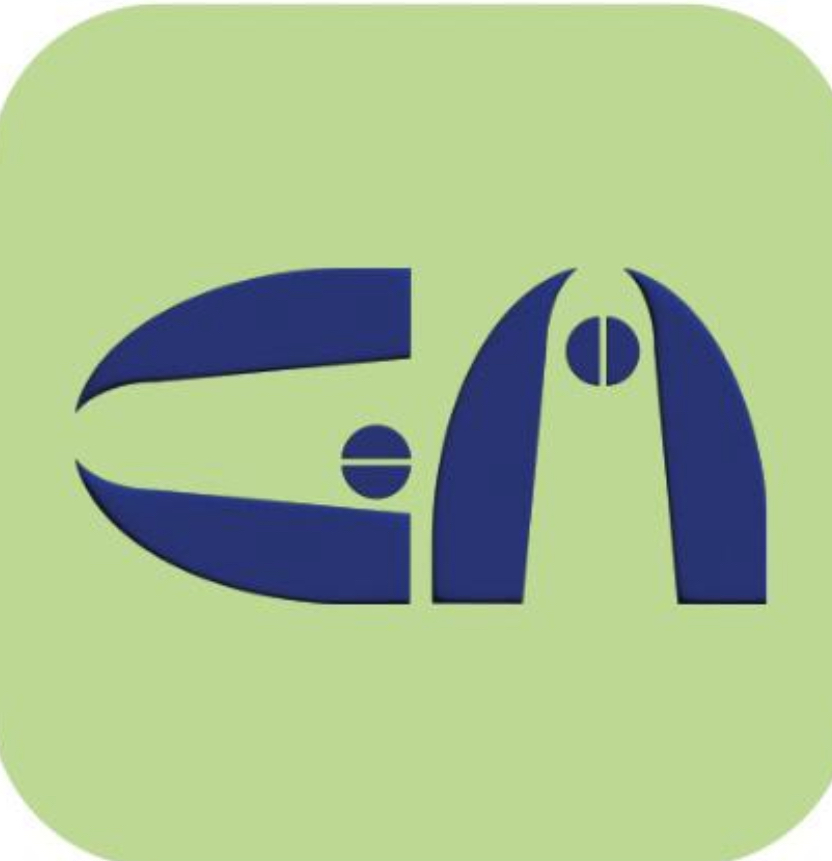
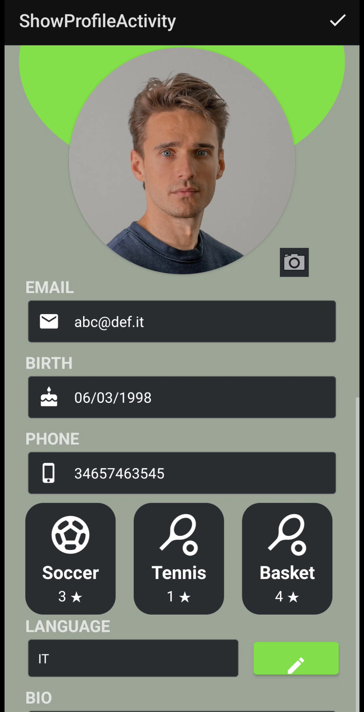
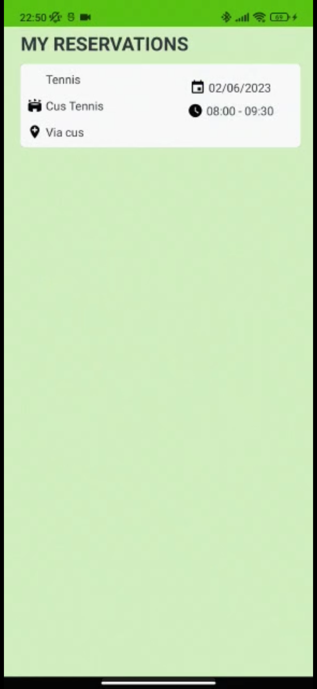
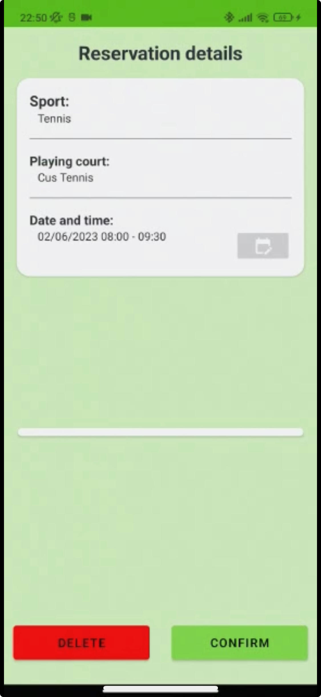
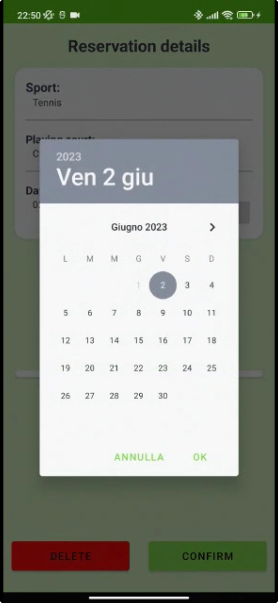

# GoMatch Android Application

## Overview

GoMatch is an Android application developed with Kotlin and Firebase, offering users the ability to book sports fields across various disciplines and engage in friendly matches with opponents. The app provides a seamless experience in finding available sports facilities, scheduling matches, and fostering a sense of competition among users.

## Features

### 1. Sports Field Booking
   - Search and browse sports fields based on location and discipline.
   - Real-time availability updates and easy booking process.

### 2. Match Scheduling
   - Plan and schedule matches with friends or opponents.
   - Integrated calendar for easy tracking of upcoming matches.

### 3. Opponent Challenges
   - Challenge other users for friendly matches.
   - Leaderboard to track user rankings and achievements.

### 4. Notifications
   - Receive notifications for upcoming matches, challenges, and facility availability.
   - Customizable notification preferences.

### 5. User Profiles
   - Create and customize user profiles.
   - Track match history, achievements, and performance statistics.

### 6. Review and Ratings
   - Leave reviews and ratings for sports facilities and opponents.
   - Feedback system for continuous improvement.

## Technology Stack

### Android Application
   - Kotlin as the primary programming language.
   - Android Studio as the development environment.

### Backend
   - Firebase Realtime Database for storing user profiles, match data, and reviews.
   - Firebase Cloud Functions for server-side logic.

## Screenshots

### 1. User Profile

*Description*: Users can create and customize profiles, track match history, and view achievements.

### 2. My Reservations

*Description*: A list of reservations made by the user, displaying relevant details.

### 3. Reservation Details

*Description*: Detailed information about a specific reservation, including time, location, and additional services.

### 4. Change Reservation

*Description*: Modify the details of a reservation, ensuring flexibility for users.
